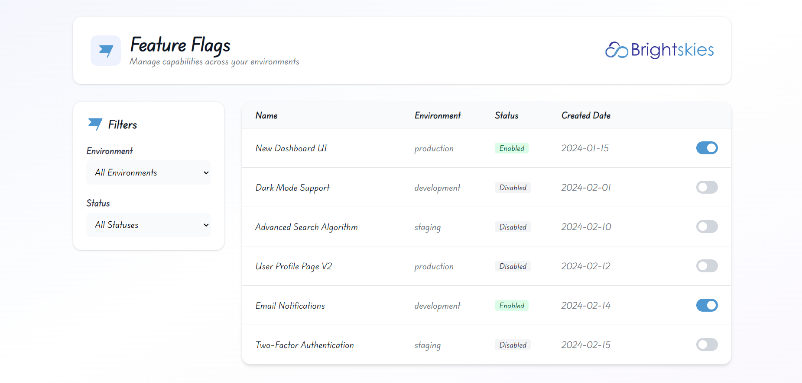

# Feature Flag Management Dashboard



A modern React application for managing feature flags across different environments (Development, Staging, Production). Built with React, TypeScript, Tailwind CSS, and a mock REST API (json server).

## 🚀 Features

- **View Feature Flags**: Display a list of feature flags with their current status, environment, and creation date.
- **Toggle Flags**: Enable or disable feature flags instantly with optimistic UI updates.
- **Filtering**: filter the list by Environment (Development, Staging, Production) and Status (Enabled, Disabled).
- **Responsive Design**: distinct, clean interface built with Tailwind CSS.
- **Mock Backend**: Uses `json-server` to simulate a RESTful API.

## 🛠️ Tech Stack

- **Framework**: React 19 (via Vite)
- **Language**: TypeScript
- **Styling**: Tailwind CSS
- **HTTP Client**: Axios
- **Mock Server**: JSON Server
- **Icons**: react-icons
- **Notifications**: react-toastify

## 📦 Installation

1.  **Install dependencies**:
    ```bash
    npm install
    ```

## 🚦 How to Run

To run the application, you need to start **both** the mock API server and the frontend development server.

1.  **Start the Mock API Server** (Terminal 1):
    ```bash
    npm run server
    ```
    *Runs json-server on port 3001*

2.  **Start the Frontend** (Terminal 2):
    ```bash
    npm run dev
    ```
    *Runs Vite on localhost:5173*

3.  Open [http://localhost:5173](http://localhost:5173) in your browser.

## 📝 functionality

- **API Integration**: The app fetches data from `http://localhost:3001/feature-flags`.
- **Optimistic Updates**: Toggling a switch updates the UI immediately while the API request is processing. If the request fails, the UI reverts and shows an error toast.
